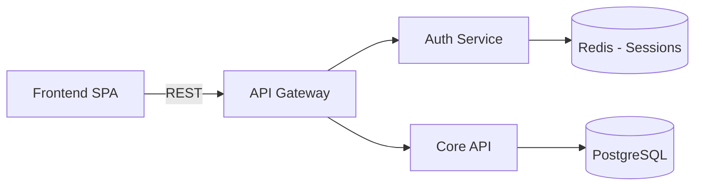
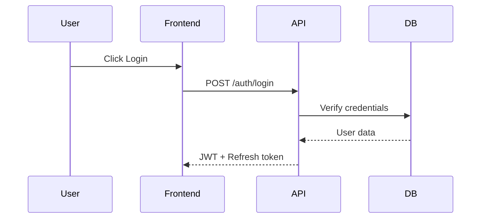
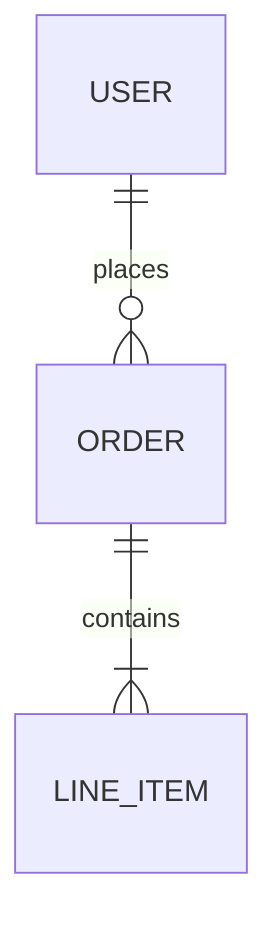
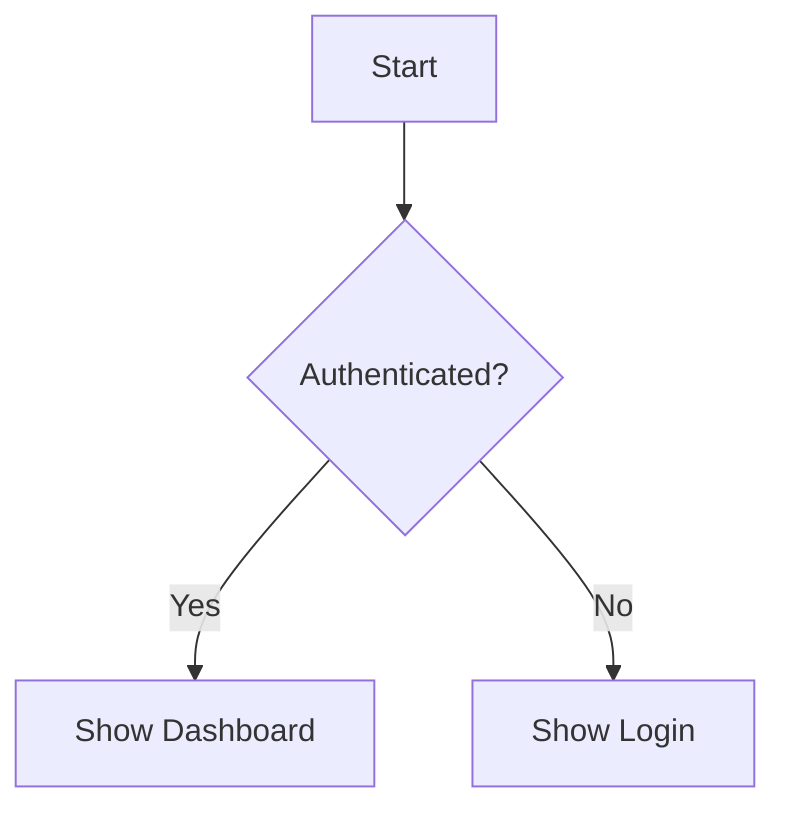

# Phase 3: Refinement (35% of session)

**Goal**: Detail the selected approach with architecture, flows, data models, security, and testing.

## Domain-Specific Refinement Areas

### Software Designs
1. **Technical Architecture** - Components, services, communication patterns
2. **Data Model** - Entities, relationships, persistence strategy
3. **User Flows** - Step-by-step user journeys with decision points
4. **API Design** - Endpoints, request/response schemas, error handling
5. **Security Controls** - Auth, authorization, encryption, compliance
6. **Testing Strategy** - Unit, integration, e2e approach
7. **Deployment** - Infrastructure, CI/CD, monitoring

### Business Designs
1. **Process Flow** - Step-by-step with decision points and handoffs
2. **Stakeholder RACI** - Responsible, Accountable, Consulted, Informed
3. **Resource Plan** - People, budget, technology needs
4. **Timeline & Milestones** - Phased delivery with dependencies
5. **Change Management** - Communication, training, adoption
6. **Risk Register** - Risks, probability, impact, mitigation

### Creative Designs
1. **Plot Structure** - Act breakdown, turning points, climax
2. **Character Development** - Arcs, relationships, motivations
3. **World Building** - Rules, geography, culture, history
4. **Scene Planning** - Key scenes, pacing, tension curves
5. **Theme Integration** - How themes manifest through story
6. **Style Guide** - Voice, tone, POV, narrative techniques

## Real-Time Design Building

**CRITICAL**: As you gather information in refinement, actively build the design document. After each significant answer:

1. Output what was just added to the design (so user sees it forming)
2. Show progress through the refinement areas
3. Generate diagrams inline using mermaid syntax

**Progress Display Pattern**:

```
Design Progress: Phase 3 - Refinement

  [x] Technical Architecture (Complete)
  [x] Data Model (Complete)
  [ ] User Flows (In Progress - 2/4 flows documented)
  [ ] API Design (Pending)
  [ ] Security (Pending)
  [ ] Testing (Pending)
```

## Diagram Generation

Generate mermaid diagrams as the design forms:

**Architecture Diagrams** (when components and relationships are clear):


**Sequence Diagrams** (when user flows are detailed):


**Entity-Relationship Diagrams** (when data model is clear):


**Flowcharts** (when processes have decision points):


## Refinement Phase Gate

Before advancing to Specification, verify:
- [ ] All major design questions answered for the domain
- [ ] At least 1 diagram generated
- [ ] Domain-specific requirements met:
  - Software: data model + API requirements + security controls defined
  - Business: process steps + decision points + resource plan documented
  - Creative: plot structure + character arcs + key scenes outlined
- [ ] Edge cases and error handling considered
