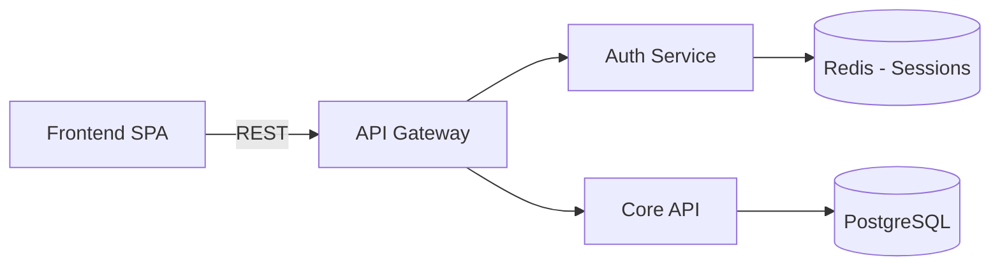
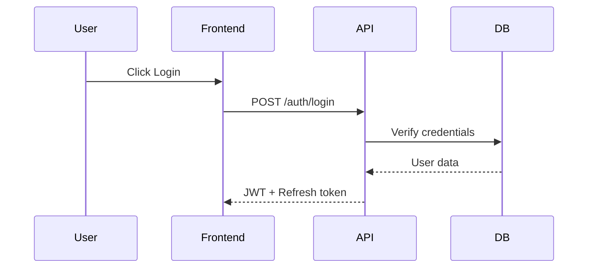
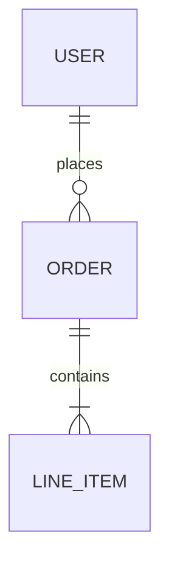
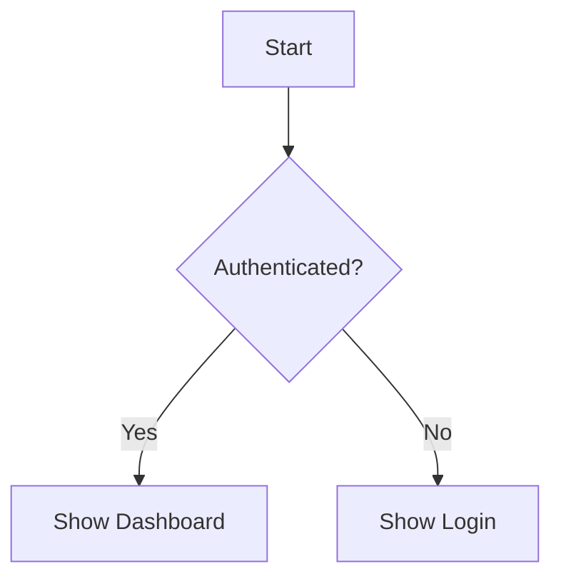

# Phase 5: Refinement (30% of session)

**Goal**: Detail the selected approach with architecture, flows, data models, security, and testing.

**Research agents**: ALWAYS spawned (no `--deep` required).

## Step 1: Read Refinement Research

Read pre-prepared research files (spawned during Ideation phase-overlap):
- `question_prep/refinement_architecture.yaml` -- Architecture deep-dive, component interactions, integration points
- `question_prep/refinement_security.yaml` -- Security analysis, auth patterns, compliance gaps
- `question_prep/refinement_testing.yaml` -- Test coverage analysis, testing patterns, testability assessment

Build question pool from all research files. Merge with domain-specific refinement areas below. If research files unavailable, fall back to domain chunk templates + inline analysis.

## Step 2: Domain-Specific Refinement (Research-Enriched)

### Software Designs
1. **Technical Architecture** - Components, services, communication patterns (enriched by architecture research)
2. **Data Model** - Entities, relationships, persistence strategy (enriched by codebase research)
3. **User Flows** - Step-by-step user journeys with decision points
4. **API Design** - Endpoints, request/response schemas, error handling (enriched by compatibility research)
5. **Security Controls** - Auth, authorization, encryption, compliance (enriched by security research)
6. **Testing Strategy** - Unit, integration, e2e approach (enriched by testing research)
7. **Deployment** - Infrastructure, CI/CD, monitoring

### Business Designs
1. **Process Flow** - Step-by-step with decision points and handoffs
2. **Stakeholder RACI** - Responsible, Accountable, Consulted, Informed
3. **Resource Plan** - People, budget, technology needs
4. **Timeline & Milestones** - Phased delivery with dependencies
5. **Change Management** - Communication, training, adoption
6. **Risk Register** - Risks, probability, impact, mitigation

### Creative Designs
1. **Plot Structure** - Act breakdown, turning points, climax
2. **Character Development** - Arcs, relationships, motivations
3. **World Building** - Rules, geography, culture, history
4. **Scene Planning** - Key scenes, pacing, tension curves
5. **Theme Integration** - How themes manifest through story
6. **Style Guide** - Voice, tone, POV, narrative techniques

## Step 3: Present Research-Enriched Questions

Use the controller pattern to present questions from the pool. Always include "Research this for me":

```javascript
AskUserQuestion({
  questions: [{
    question: "Your existing API uses RESTful routes with /api/v1/ prefix and camelCase response fields (found in src/routes/). Should the new endpoints follow the same conventions?",
    header: "API Design",
    options: [
      {label: "Follow existing patterns", description: "Match /api/v1/ prefix, camelCase, existing error format"},
      {label: "New API version", description: "Create /api/v2/ with updated conventions"},
      {label: "GraphQL alongside REST", description: "Add GraphQL for new features, keep REST for existing"},
      {label: "Research this for me", description: "Dispatch a subagent to analyze API patterns in depth"}
    ],
    multiSelect: false
  }]
})
```

**Controller adaptation during Refinement**:
- After each answer, check if remaining questions need reordering
- If user's answer reveals unexpected constraints, dispatch follow-up research
- Skip questions where research + previous answers already provide the information
- Enrich upcoming questions with user's design decisions

## Step 4: Real-Time Design Building

**CRITICAL**: As you gather information, actively build the design document. After each significant answer:

1. Output what was just added to the design (so user sees it forming)
2. Show progress through the refinement areas
3. Generate diagrams inline using mermaid syntax

**Progress Display Pattern**:

```
Design Progress: Phase 5 - Refinement

  [x] Technical Architecture (Complete)
  [x] Data Model (Complete)
  [ ] User Flows (In Progress - 2/4 flows documented)
  [ ] API Design (Pending)
  [ ] Security (Pending)
  [ ] Testing (Pending)
```

## Step 5: Diagram Generation

Generate mermaid diagrams as the design forms:

**Architecture Diagrams** (when components and relationships are clear):


**Sequence Diagrams** (when user flows are detailed):


**Entity-Relationship Diagrams** (when data model is clear):


**Flowcharts** (when processes have decision points):


## Step 6: Specialist Agent Delegation (Validation)

Research agents prepare QUESTIONS. Specialists validate ANSWERS. For complex designs (tier 3+), spawn specialist agents to validate emerging design decisions:

```
Specialist delegation for VALIDATION (in addition to research agents for PREPARATION):
  designer -> Task(cagents:architect, "Validate proposed architecture against {constraints}")
  designer -> Task(cagents:security-specialist, "Validate security design for {sensitive_areas}")
  designer -> Task(cagents:qa-lead, "Validate testability of proposed design")

Trigger criteria:
  - Design involves system architecture decisions (spawn architect)
  - Design touches authentication, data privacy, or sensitive data (spawn security-specialist)
  - Design proposes new data models or API contracts (spawn backend-developer)
  - Design scope estimated as tier 3+ complexity

Keep specialist prompts under 300 tokens. Include: the question, where to look, what to report.
```

## Step 7: Follow-Up Research Dispatch

Throughout Refinement, dispatch follow-up research when user reveals unexpected information:

```javascript
Task({
  subagent_type: "cagents:architect",
  description: "Follow-up research: real-time architecture",
  prompt: `Follow-up research for /designer Refinement.
TOPIC: ${topic}
NEW INFO: User needs real-time updates (WebSocket/SSE)
Investigate: existing WebSocket setup, suitable real-time patterns for ${tech_stack}.
Write to: ${session_dir}/question_prep/followup_refinement_realtime.yaml`
})
```

## Refinement Phase Gate + Phase-Overlap

Before advancing to Specification, verify:
- [ ] All major design questions answered for the domain
- [ ] At least 1 diagram generated
- [ ] Domain-specific requirements met:
  - Software: data model + API requirements + security controls defined
  - Business: process steps + decision points + resource plan documented
  - Creative: plot structure + character arcs + key scenes outlined
- [ ] Edge cases and error handling considered
- [ ] Specialist validation feedback incorporated (if delegation was triggered)

**Phase-Overlap**: At ~60% completion (5+ refinement questions answered), spawn Specification research agents:

```javascript
Task({
  subagent_type: "cagents:backend-developer",
  description: "Research: Codebase compatibility for Specification phase",
  prompt: `Research agent for Specification codebase compatibility.
TOPIC: ${topic}
SESSION: ${session_dir}
DESIGN: Read ${session_dir}/phases/05_refinement.md (partial -- in progress)
Check: existing API patterns, naming conventions, model patterns, test patterns, imports.
Flag any incompatibilities with proposed design.
Write to: ${session_dir}/question_prep/specification_compatibility.yaml`
})
```
